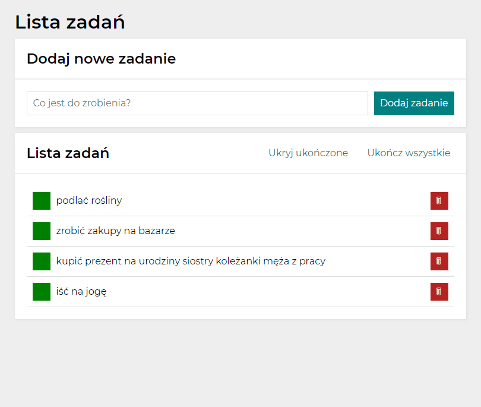

# to-do-list

## demo
https://mal-vka.github.io/to-do-list/

## description
This is a simple to-do-list which allows you to add, mark and remove your daily tasks.
It is made for educational purposes as a second JS's project and further HTML&CSS training.
To build this simple website, I used:
- `if` statements, `for` loops and `.forEach` method, function structures in block with `init` function, `addEventListener` method, the possibilities offered by the `<form>` element - to add simple functionalities of operation on arrays which is the main logic of the site;
- ES6 features;
- the semantic HTML and the BEM methodology - for clear and structured references;
- cdn normalize;
- OpenGraph tags.

## preview

## further development
Project will be evolving along with my programming skills. Probably, second version will be based on react framework.
Other ideas:
- added possibility of changing background-color with fancy switch button
- create functionality of switching between few lists

## inspiration/source
The exercise scenario with imposed apperance comes from the frontend course [YouCode](https://youcode.pl/) but is made by me.
